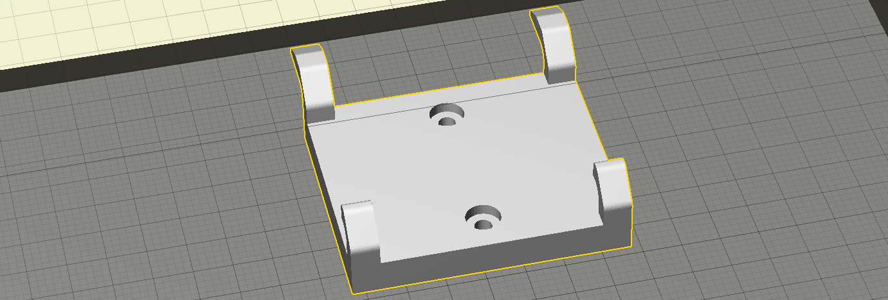

# LEGO Mclaren Formula 1 - Wall Mount

Used to mount the LEGO Mclaren Formula 1 (2022 Technical Regulament) Race Car to a wall. Simply screw the mount into the wall, then slide the car onto it.

## Technical References
[Brian deMaio, LEGO Mclaren Formula 1](https://www.printables.com/model/194683-lego-mclaren-formula-1-wall-mount/files)